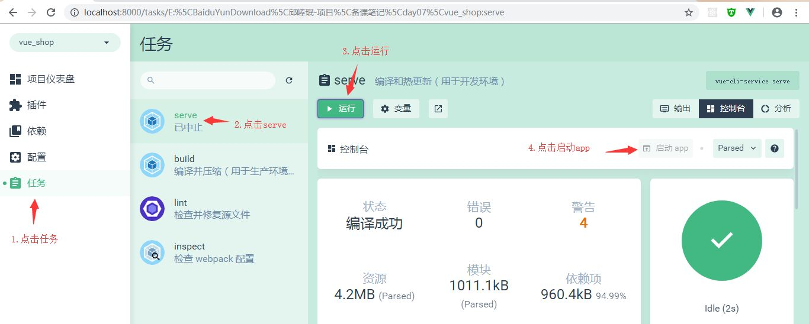

### 今日目标

1. 初始化项目 
2. 基于`Vue`技术栈进行项目开发
3. 使用`Vue`的第三方组件进行项目开发
4. 理解前后端分离开发模式

## 1. 电商业务概述

客户使用的业务服务：PC端，小程序，移动web，移动app
管理员使用的业务服务：PC后台管理端。
PC后台管理端的功能：管理用户账号（登录，退出，用户管理，权限管理），商品管理（商品分类，分类参数，商品信息，订单），数据统计
电商后台管理系统采用前后端分离的开发模式
前端项目是基于`Vue`的SPA（单页应用程序）项目

前端技术栈:`Vue`,`Vue-Router`,`Element-UI`,`Axios`,`Echarts`
后端技术栈：`Node.js`,`Express`,`Jwt`(模拟session),`Mysql`,`Sequelize`(操作数据库的框架)

## 2. 项目初始化

A. 安装`Vue`脚手架
B. 通过脚手架创建项目
C. 配置路由
D. 配置`Element-UI`:在插件中安装，搜索`vue-cli-plugin-element`
E. 配置`Axios`：在依赖中安装,搜索`axios`(运行依赖)
F. 初始化git仓库
G. 将本地项目托管到`github`或者码云中

## 3. 码云相关操作

## 4. 配置项目后台

A. 解压 `vue_api_server` 文件夹，在本地新建一个数据库，使用`source`指令从`mydb.sql`中导入数据

B. 在 `vue_api_server` 中先`npm install `安装依赖，然后`npm app.js`运行后台，打开服务器


## 5. 实现登录功能

### 1）. 基本

A.登录状态保持
如果服务器和客户端**同源**，建议可以使用**cookie**或者**session**来保持登录状态
如果客户端和服务器**跨域**了，建议使用**token**进行维持登录状态。

B.登录逻辑：
在登录页面输入账号和密码进行登录，将数据发送给服务器
服务器返回登录的结果，**登录成功则返回数据中带有token**
客户端得到token并进行保存，后续的请求都需要将此token发送给服务器，服务器会**验证token以保证用户身份**。

C.然后执行`vue ui`命令打开ui界面，然后运行serve，运行app查看当前项目效果


发现现在是一个默认页面，我们需要进行更改，打开项目的`src`目录，点击`main.js`文件（入口文件）
```
import Vue from 'vue'
import App from './App.vue'
import router from './router'
import './plugins/element.js'

Vue.config.productionTip = false


new Vue({
  router,
  render: h => h(App)
}).$mount('#app')

```
* 再打开`App.vue`(根组件)，将根组件的内容进行操作梳理(template中留下根节点，script中留下默认导出，去掉组件，style中去掉所有样式)

```
<template>
  <div id="app">
    <router-view></router-view>
  </div>
</template>

<script>
export default {
  name: 'app'
}
</script>

<style>
</style>
```
* 再**打开`index.js`(路由)**，将routes数组中的路由规则清除，然后**将`views`删除**，**将components中的`helloworld.vue`删除**

```
import Vue from 'vue'
import Router from 'vue-router'

Vue.use(Router)

export default new Router({
  routes: [
    
  ]
})
```
* 在components文件夹中新建`Login.vue`组件,添加template，script，style标签,**style标签中的scoped可以防止组件之间的样式冲突**，没有scoped则样式是全局的

```
<template>
    <div class="login_container">
        
    </div>
</template>

<script>
export default {
  
}
</script>

<style lang="less" scoped>
.login_container {
  background-color: #2b5b6b;
  height: 100%;
}

</style>
```


### 2）. 添加一些配置

**A.  添加element-ui的表单组件**
在`plugins`文件夹中打开`element.js`文件，进行`element-ui`的按需导入

```javascript
import Vue from 'vue'
import { Button } from 'element-ui'
import { Form, FormItem } from 'element-ui'
import { Input } from 'element-ui'

Vue.use(Button)
Vue.use(Form)
Vue.use(FormItem)
Vue.use(Input)
```

#### 例如：弹窗

```javascript
import {Message} from 'element-ui
// 进行全局挂载
Vue.prototype.$message = Message;
// 在.vue组件中使用
this.$message.error('登录失败')
```


**B. 添加第三方字体**

 1. 复制素材中的fonts文件夹到assets中,

 2. 在入口文件`main.js`中导入`import './assets/fonts/iconfont.css'`
    然后直接设置input框的`prefix-icon`属性

    ```javascript
     <el-input prefix-icon="iconfont icon-3702mima"></el-input>
    ```

    

**C. 添加表单验证的步骤**

1. 给`<el-form>`添加属性`:rules="rules"`，rules是一堆验证规则，定义在script中

2. 在`script`中的`data`中添加`rules`：

    ```javascript
    export default{ 
        data(){return{
            ......, 
            loginRules: {
                name: [
                    { required: true, message: '请输入活动名称', trigger: 'blur' },
                    { min: 3, max: 5, message: '长度在 3 到 5 个字符', trigger: 'blur' }
                ],
                region: [
                    { required: true, message: '请选择活动区域', trigger: 'change' }
                ]
    		}......
    		}
    	}
    }
    ```

    

3. 通过`<el-form-item>`的prop属性设置验证规则`<el-form-item label="活动名称" prop="name">`

    ```vue
     <el-form :rules="loginRules" class="login_form">
            <el-form-item prop="username"> <!-- 用户名 -->
            </el-form-item>
     </el-form>
    ```

    

**D. 在`index.js`中导入组件并设置规则，再在`App.vue`中添加 路由占位符**

```
const router = new Router({
  routes: [
    { path: '/', redirect: '/login' },
    { path: '/login', component: Login }
  ]
})
```


**E. 当我们给`Login.vue`中的内容添加样式的时候，会报错“缺少less-loader”，需要配置less加载器（开发依赖），安装less(开发依赖)**

**F. 添加公共样式**

1. 在assets文件夹下面添加`css`文件夹，创建`global.css`文件,添加全局样式

```
/* 全局样式表 */
html,body,#app{
    width: 100%;
    height: 100%;
    margin: 0;
    padding: 0; 
}
```

  2. 在main.js中导入global.css，使得全局样式生效 `import "./assets/css/global.css"`
     然后`Login.vue`中的根元素也需要设置撑满全屏（height:100%）

     

### 3）. 导入`axios`以发送ajax请求

1. 打开main.js，`import axios from 'axios';`

2. 设置请求的根路径：`axios.defaults.baseURL = 'http://127.0.0.1:8888/api/private/v1/';`

3. 全局挂载`axios：Vue.prototype.$http = axios;`，那么用`this.$http`就可以代替`axios`发请求

    


### 4）.登录成功之后的操作

A. 登录成功之后，需要**将后台返回的`token`保存到`sessionStorage`中**
	操作完毕之后，需要跳转到/home

```javascript
login() {
      //点击登录的时候先调用validate方法验证表单内容是否有误
      this.$refs.LoginFormRef.validate(async valid => {
        console.log(this.loginFormRules)
        //如果valid参数为true则验证通过
        if (!valid) {
          return
        }

        //发送请求进行登录
        const { data: res } = await this.$http.post('login', this.loginForm)
        if (res.meta.status !== 200) {
        	return this.$message.error('登录失败:' + res.meta.msg) 
        	//console.log("登录失败:"+res.meta.msg)
        }

        this.$message.success('登录成功')
          
        //保存token
        window.sessionStorage.setItem('token', res.data.token)
        // 导航至/home
        this.$router.push('/home')
      })
}
```
**B. 添加一个组件`Home.vue`，并为之添加规则**

```javascript
<template>
    <div>
        this is home
        <el-button type="info" @click="logout"> 退出 </el-button>
    </div>
</template>

<script>
export default {
  methods: {
    logout() {// 退出
        // 清空token
        window.sessionStorage.clear()
        this.$router.push('/login')
    }
  }
}
</script>

<style lang='less' scoped>
</style>
```
​		添加路由规则
```
const router = new Router({
  routes: [
    { path: '/', redirect: '/login' },
    { path: '/login', component: Login },
    { path: '/home', component: Home }
  ]
})
```

**C. 添加路由守卫**——将原来的操作分成三步走
	如果用户没有登录，不能访问/home,如果用户通过url地址直接访问，则强制跳转到登录页面
	打开router.js

```javascript
/* index.js */

// 创建一个router对象
const router = new Router({
  routes: []
})

//挂载路由导航守卫,to表示将要访问的路径，from表示从哪里来，next放行下一个要做的操作
router.beforeEach((to,from,next)=>{ 
	if(to.path === '/login')
    	return next();
  	//获取token
  	const tokenStr = window.sessionStorage.getItem('token');
	// token不存在，就需要登录
  	if(!tokenStr)
    	return next('/login');

  	next();
})

// 向外抛出
export default router 
```


---

---

---

## 补充

A. 处理`ESLint`警告
	打开脚手架面板，查看警告信息
	默认情况下，`ESLint`和`vscode`格式化工具有冲突，需要添加配置文件解决冲突。
	在项目根目录添加`.prettierrc` 文件

```
{
    "semi":false,
    "singleQuote":true
}
```
打开`.eslintrc.js`文件，禁用对 `space-before-function-paren` 的检查:
```
  rules: {
    'no-console': process.env.NODE_ENV === 'production' ? 'error' : 'off',
    'no-debugger': process.env.NODE_ENV === 'production' ? 'error' : 'off',
    'space-before-function-paren' : 0
  },
```

B.合并按需导入的element-ui
```
import Vue from 'vue'
import { Button, Form, FormItem, Input, Message } from 'element-ui'

Vue.use(Button)
Vue.use(Form)
Vue.use(FormItem)
Vue.use(Input)
// 进行全局挂载：
Vue.prototype.$message = Message
```


